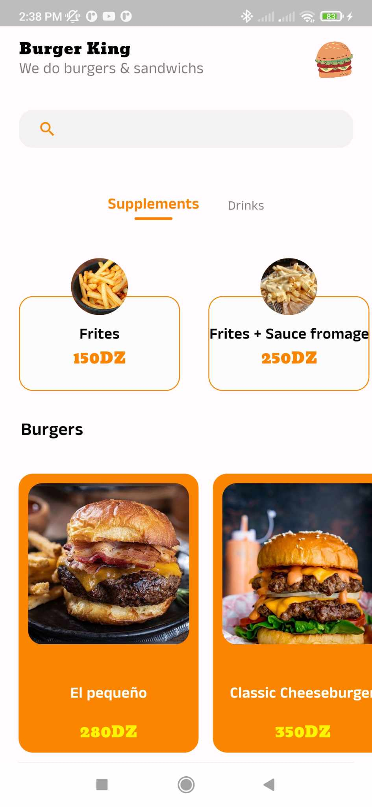
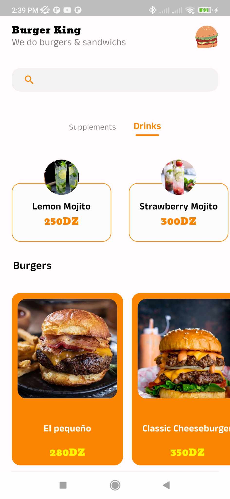
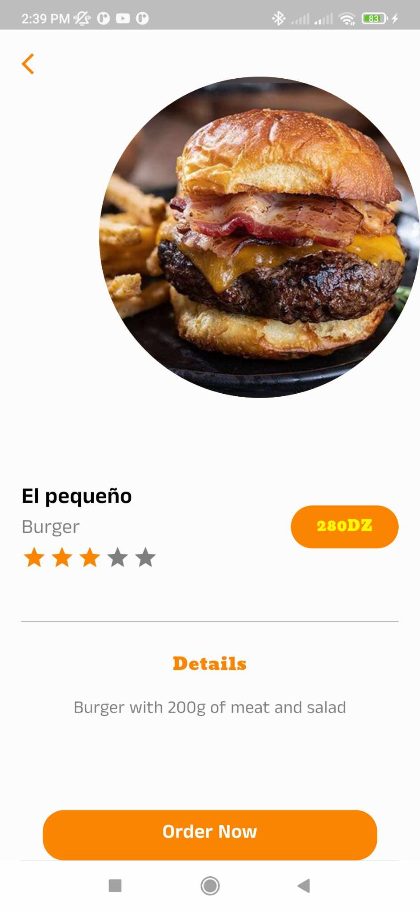
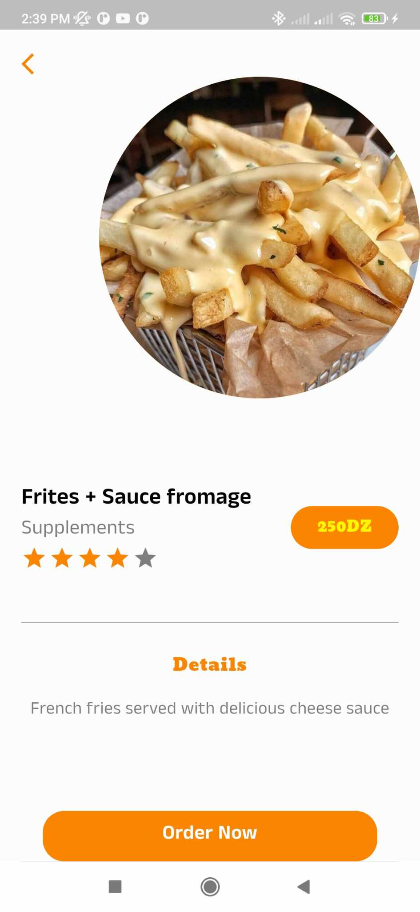

### Hi GitHub community 👋
I designed and developed a Flutter UI app for a burger restaurant called ***burger_king***.
    
### 🔭 key features
-----
 - User-friendly interface.
 - A menu section showcasing burgers, sides, and drinks.
 - A search feature for easy navigation through the menu.
 - A well-organized code that's now available on GitHub for anyone interested in learning Flutter.

### ✨ Installation
-----
 1. Clone this repository:
```bash
git clone <repository-url>
```

2. Run the application:
```bash
flutter run lib/main.dart
```

3. build the Android APK:
```bash
flutter build apk
```
### ScreenShots








